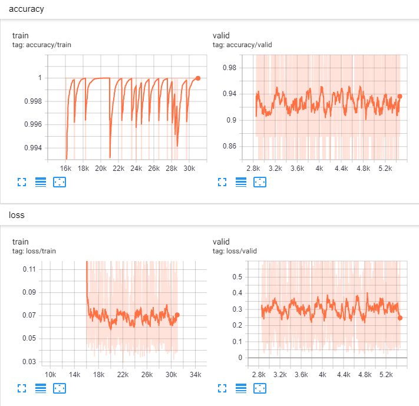

# stanford-cars-model (under development)

A PyTorch model for Stanford Cars Classification

### Dependencies
- python 3.7
- pytorch
- scikit-image
- numpy
- opencv-python
- tensorboard

### Install
- pytorch: see https://pytorch.org/get-started/locally/

- scikit, opencv
    ```angular2html
    pip install scikit-image numpy opencv-python tensorboard
    ```

### Extract training & testing data using annotation bounding box

#### Data Prepare
  ```
  data_processing/
  │
  ├── datasets/ - folder contain training & testing data
      ├── cars_metas/ - folder contain meta data for training & testing
          ├── cars_train_annos.mat - train meta
          ├── cars_test_annos_withlabels.mat - test meta
      ├── training/
          ├── original/ - original cars from training data
            ├── 00001.jpg
            ├── 00002.jpg
            ├── 00003.jpg
            ├── 00004.jpg
            ├── ...
          ├── extracted/ - cars after extracted using bounding box label
      ├── testing/
          ├── original/ - original cars from testing data
            ├── 00001.jpg
            ├── 00002.jpg
            ├── 00003.jpg
            ├── 00004.jpg
            ├── ...
          ├── extracted/ - cars after extracted using bounding box label
          
  ```
  
  Training data download: http://imagenet.stanford.edu/internal/car196/cars_train.tgz 
  
  Testing data download: http://imagenet.stanford.edu/internal/car196/cars_test.tgz
  
  After download, extract and copy image to ```data_processing/datasets/training/original``` and ```data_processing/datasets/testing/original```
#### Data Extract

Standford Cars Dataset come with annotated label, so we would like to use it to extract only cars and remove background. This help our model focus only on vehicles

For training: 
```
cd data_processing
python extract_cars.py --meta "datasets/cars_metas/cars_train_annos.mat" -input "datasets/training/original/ -output "datasets/training/extracted/"
```
For testing:
```
cd data_processing
python extract_cars.py --meta "datasets/cars_metas/cars_test_annos_withlabels.mat" -input "datasets/testing/original/ -output "datasets/testing/extracted/"
```

## Training

The model contain:

- ResNet 151 
- Cyclic Learning Rate: default from 0.01 to 0.1
- Auto Augmentation with ImageNet pretrained

You can start training model imediately with the following script:

```angular2html
python train.py -c train_config.json
```

Resuming

```angular2html
python train.py -c train_config.json -r "path/to/model.pth"
```

## Visualization



## Testing
```angular2html
python test.py -c test_config.json -m "pretrained_model.pth" -o "test_output/"
```


## Final result
Test Accuracy: 93.4%
